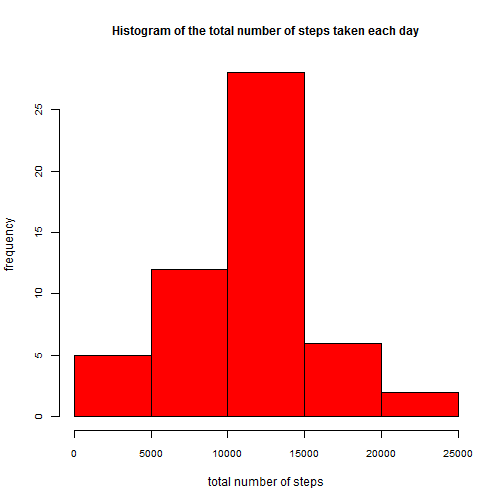
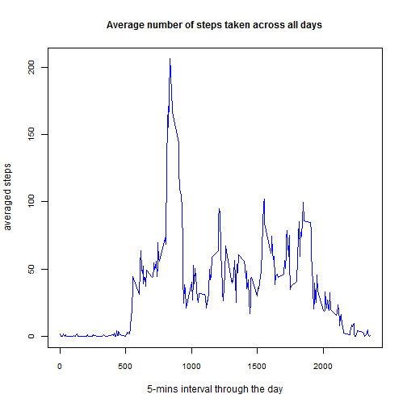
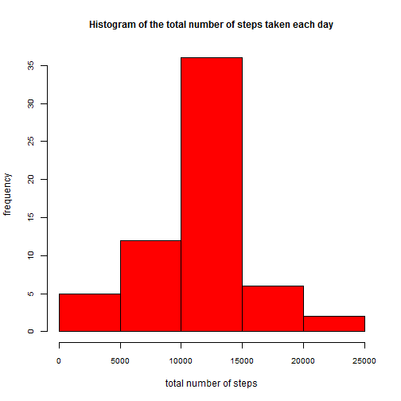
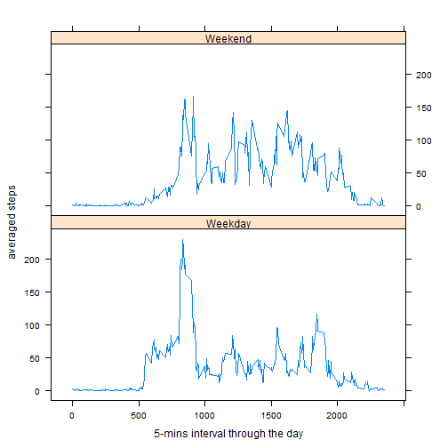

This is an R Markdown document.

## First, loading the data


```r
data<-read.csv("activity.csv",header=T)
str(data)
```

```
## 'data.frame':	17568 obs. of  3 variables:
##  $ steps   : int  NA NA NA NA NA NA NA NA NA NA ...
##  $ date    : Factor w/ 61 levels "2012-10-01","2012-10-02",..: 1 1 1 1 1 1 1 1 1 1 ...
##  $ interval: int  0 5 10 15 20 25 30 35 40 45 ...
```

```r
head(data,10)
```

```
##    steps       date interval
## 1     NA 2012-10-01        0
## 2     NA 2012-10-01        5
## 3     NA 2012-10-01       10
## 4     NA 2012-10-01       15
## 5     NA 2012-10-01       20
## 6     NA 2012-10-01       25
## 7     NA 2012-10-01       30
## 8     NA 2012-10-01       35
## 9     NA 2012-10-01       40
## 10    NA 2012-10-01       45
```

## Secondly, converting the 'date' variable from Factor to Date


```r
data$date <- as.POSIXct(data$date)
Sys.setlocale(category = "LC_TIME", locale = "C")
```

```
## [1] "C"
```

```r
str(data)
```

```
## 'data.frame':	17568 obs. of  3 variables:
##  $ steps   : int  NA NA NA NA NA NA NA NA NA NA ...
##  $ date    : POSIXct, format: "2012-10-01" "2012-10-01" ...
##  $ interval: int  0 5 10 15 20 25 30 35 40 45 ...
```

Then, it is possible to respond to the questions one by one

## Question 1: What is mean total number of steps taken per day?

Q1.1 Make a histogram of the total number of steps taken each day

```r
library(data.table)
library(dplyr)
Sys.setlocale(category = "LC_TIME", locale = "C")
```

```
## [1] "C"
```

```r
result1<-
  data%>%
    group_by(date)%>%
    summarize(total_steps=sum(steps))%>%
    arrange(date,total_steps)    

hist (result1$total_steps,xlab="total number of steps",ylab="frequency",cex.axis=0.8,col="red",main="Histogram of the total number of steps taken each day",cex.main=1)
```

 

Q1.2 Calculate and report the mean and median total number of steps taken per day

```r
mean_steps1<-mean(result1$total_steps,na.rm=T)
mean_steps1
```

```
## [1] 10766.19
```

```r
median_steps1<-median(result1$total_steps,na.rm=T)
median_steps1
```

```
## [1] 10765
```

## Question 2: What is the average daily activity pattern?


Q2.1 Make a time series plot (i.e. type = "l") of the 5-minute interval (x-axis) and the average number of steps taken, averaged across all days (y-axis)


```r
result2<-
  data%>%
    group_by(interval)%>%
    summarize(avg_steps=mean(steps,na.rm=T))%>%
    arrange(interval,avg_steps)

plot(result2$interval,result2$avg_steps,type="l",xlab="5-mins interval through the day",ylab="averaged steps",cex.axis=0.8,col="blue",main="Average number of steps taken across all days",cex.main=1)
```

 

Q2.2 Which 5-minute interval, on average across all the days in the dataset, contains the maximum number of steps?

```r
result2[max(result2$avg_steps),]
```

```
## Source: local data frame [1 x 2]
## 
##   interval avg_steps
## 1     1705  56.30189
```

## Question3: Imputing missing values
Q3.1 Calculate and report the total number of missing values in the dataset (i.e. the total number of rows with NAs)

```r
sum(is.na(data$steps))
```

```
## [1] 2304
```

Q3.2 Use the average steps of 5-mins interval to replace the missing value and save to another dataset of data2

```r
mergeData2=merge(data,result2,by.x="interval",by.y="interval")
mergeData2$steps[is.na(mergeData2$steps)]<-mergeData2$avg_steps[is.na(mergeData2$steps)]
data2<-
  mergeData2%>%
  select(steps,date,interval)%>%
  arrange(date,interval)
```

Q3.3 Make a histogram of the total number of steps taken each day and Calculate and report the mean and median total number of steps taken per day

```r
result3<-
  data2%>%
  group_by(date)%>%
  summarize(total_steps=sum(steps))%>%
  arrange(date,total_steps)

hist (result3$total_steps,xlab="total number of steps",ylab="frequency",cex.axis=0.8,col="red",main="Histogram of the total number of steps taken each day",cex.main=1)
```

 

```r
mean_steps2<-mean(result3$total_steps)
mean_steps2
```

```
## [1] 10766.19
```

```r
median_steps2<-median(result3$total_steps)
median_steps2
```

```
## [1] 10766.19
```

Q3.4 Do these values differ from the estimates from the first part of the assignment? What is the impact of imputing missing data on the estimates of the total daily number of steps

*After imputing missing data, "mean" is as the same as "median"*

## Question 4: Are there differences in activity patterns between weekdays and weekends?

Use the dataset with the filled-in missing values for this part

Q4.1 Create a new factor variable in the dataset with two levels ¨C ¡°weekday¡± and ¡°weekend¡± indicating whether a given date is a weekday or weekend day

```r
data3<-cbind(data2,wday=weekdays(data2$date))
weekend<-data3[data3$wday=="Saturday"|data3$wday=="Sunday",]
weekend$wday="Weekend"
weekday<-data3[data3$wday!="Saturday" & data3$wday!="Sunday",]
weekday$wday="Weekday"
totaldata<-rbind(weekday,weekend)
str(totaldata)
```

```
## 'data.frame':	17568 obs. of  4 variables:
##  $ steps   : num  1.717 0.3396 0.1321 0.1509 0.0755 ...
##  $ date    : POSIXct, format: "2012-10-01" "2012-10-01" ...
##  $ interval: int  0 5 10 15 20 25 30 35 40 45 ...
##  $ wday    : chr  "Weekday" "Weekday" "Weekday" "Weekday" ...
```

Q4.2 Make a panel plot containing a time series plot (i.e. type = "l") of the 5-minute interval (x-axis) and the average number of steps taken, averaged across all weekday days or weekend days (y-axis). 


```r
library(lattice)
result4<-
  totaldata%>%
  group_by(interval,wday)%>%
  summarize(avg_steps=mean(steps))
  
  
xyplot(avg_steps~interval|factor(wday),data=result4,type="l",xlab="5-mins interval through the day",ylab="averaged steps",cex.axis=0.8,layout=c(1,2))
```

 
